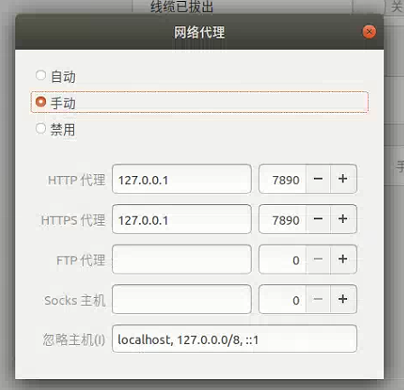
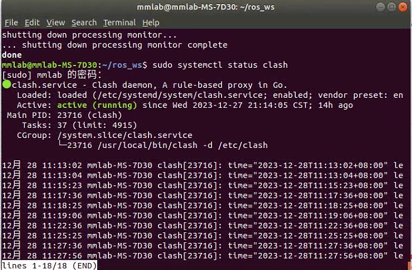

### Clash 下载

原作者@[Dreamacro](https://github.com/Dreamacro)已出于部分原因删库，这里提供删库时的最新版本供大家下载，**请注意架构。**

尊重开源。勿做二次售卖。

将下载的.gz文件解压缩：

```shell
gzip -d clash-linux-amd64-v1.18.0.gz
mv clash-linux-amd64-v1.18.0 clash
```

为 Clash 添加可执行权限：

```shell
sudo chmod +x clash
```

### Clash 运行的配置文件

Clash 在运行时需要两个文件，一个是`Country.mmdb`，另外一个是由网络服务商（机场）提供的`config.yaml`。 

#### Country.mmdb

Country.mmdb会在第一次运行Clash时自动下载：

```shell
./clash -d .
```

如果下载失败，可以访问该[链接](https://github.com/Dreamacro/maxmind-geoip/releases)手动下载，并放置到与Clash同一目录下。

> `Country.mmdb` 文件利用 GeoIP2 服务能识别互联网用户的地点位置，以供规则分流时使用。

#### config.yaml

该文件由网络服务商提供，包含了订阅链接、节点信息、代理分组等等内容。一般是提供一个链接让你下载。得到这个链接后，用wget下载Clash配置文件

```shell
wget -O config.yaml "$YOUR_LINK"
```

该文件同样保存与Clash同一目录下，方便我们后续编写开机自启动程序。

### 运行Clash

现在你可以在当前目录下测试Clash运行效果。

```shell
./clash -d .
```

并在系统代理设置中配置HTTP和HTTPS代理。



在浏览器中访问[Clash Dashboard](https://clash.razord.top/)可以进行切换节点、测延时等操作。

### 配置Clash 为 daemon

> Daemon（守护进程）是运行在后台的一种特殊进程。它独立于控制终端并且周期性地执行某种任务或等待处理某些发生的事件。它不需要用户输入就能运行而且提供某种服务，不是对整个系统就是对某个用户程序提供服务。Linux系统的大多数服务器就是通过守护进程实现的。

#### 配置 systemd 服务

Linux 系统使用 systemd 作为启动服务器管理机制，首先把 Clash 可执行文件拷贝到 `/usr/local/bin` 目录，相关配置拷贝到 `/etc/clash` 目录。

```shell
sudo mkdir /etc/clash
sudo cp clash /usr/local/bin
sudo cp config.yaml /etc/clash/
sudo cp Country.mmdb /etc/clash/
```

创建 systemd 服务配置文件 `sudo gedit /etc/systemd/system/clash.service`，写入如下内容：

```shell
[Unit]
Description=Clash daemon, A rule-based proxy in Go.
After=network.target

[Service]
Type=simple
Restart=always
ExecStart=/usr/local/bin/clash -d /etc/clash

[Install]
WantedBy=multi-user.target
```

#### 使用 systemctl

使用以下命令，让 Clash 开机自启动：

```
sudo systemctl enable clash
```

然后开启 Clash：

```
sudo systemctl start clash
```

检查 Clash 的运行状态：

```
sudo systemctl status clash
```

如下图所示显示`active (running)`则为正常运行中：



<br/>

<br/>

<p align="right"><i> <font color = "brown">Last update on</font>: 2023/12/28 </i></p>

