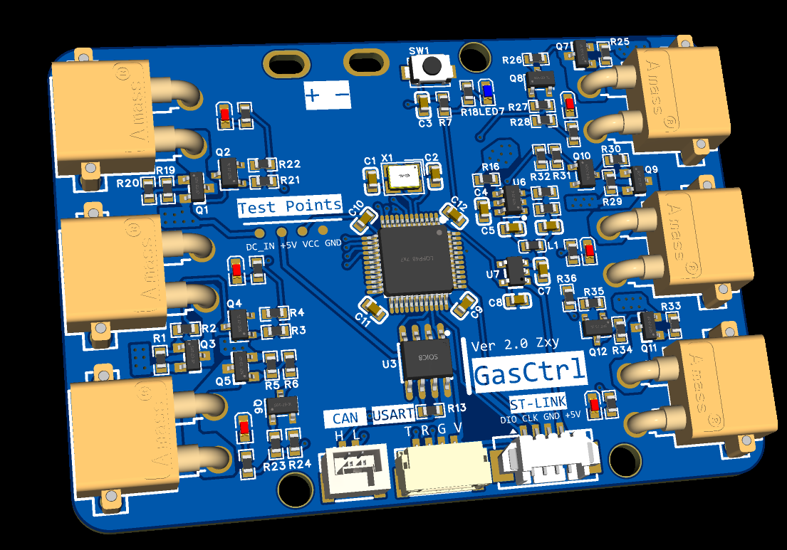
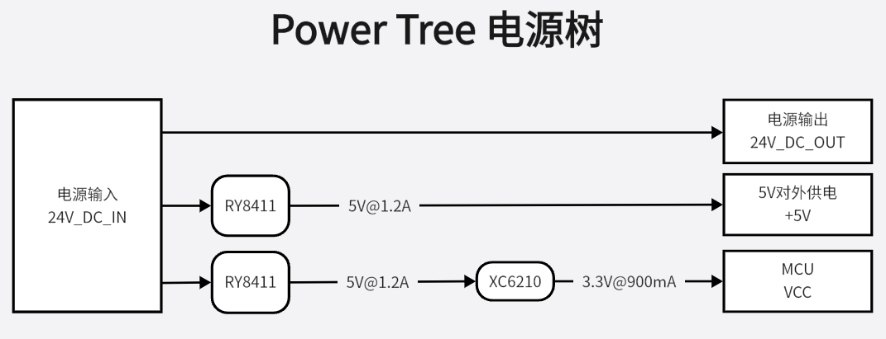
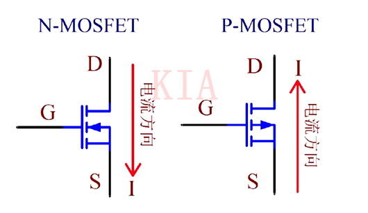
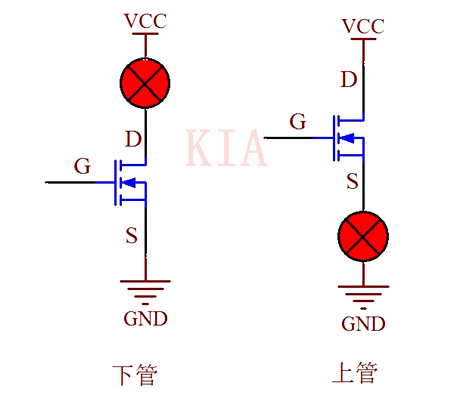
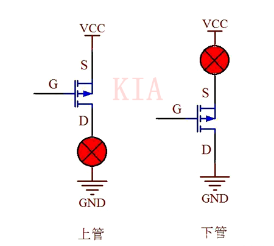
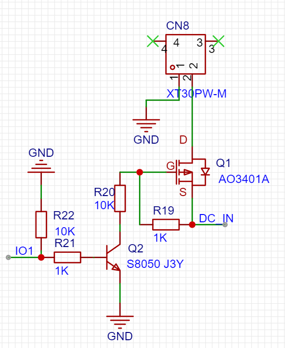

### 简介

24V六路气阀控制板，可与主控板通过CAN、串口进行通讯，最多可同时控制6路电磁阀。解决每一个电磁阀都需要一个继电器单独控制的问题，精简控制线路。

项目地址：https://github.com/zxytql/Hardware-Projects/tree/master/GasCtrl

### 硬件介绍

- MCU：STM32F103C8T6
- 对外通讯协议：USART、CAN

介绍六路气阀控制板工作原理之前，需要先了解一下MOS管的开通/关断原理。

#### MOS管的开通/关断原理

> 该部分图片及部分正文内容来自 [NMOS和PMOS应用电路设计图文分享](http://www.kiaic.com/article/detail/3247.html)，感谢作者

上图标出了N-MOS和P-MOS两种MOS管在导通时的电流方向。NMOS管的主回路电流方向为D→S，导通条件为Vgs有一定的压差，一般为5~10V（G电位比S电位高）；而PMOS管的主回路电流方向为S→D，导通条件为VGS有一定的压差，一般为 -5 ~ -10V（S电位比G电位高），**下面以导通压差6V为例。**

1. **一般使用NMOS当下管，**S极直接接地（为固定值），只需将G极电压**固定值6V**即可导通；若使用NMOS当上管，D极接正电源，而S极的电压不固定，无法确定控制NMOS导通的G极电压，因为S极对地的电压有两种状态，MOS管截止时为**低电**，导通时接**高电**VCC。

2. **一般使用PMOS当上管，**S极直接接电源VCC，S极电压固定，只需G极电压比S极低6V即可导通，使用方便；若使用PMOS当下管，D极接地，S极的电压不固定（0V或VCC），无法确定控制极G极的电压，使用较麻烦，需采用隔离电压设计。

#### 本控制板工作原理

在六路气阀控制板中，各路控制原理是一样的，以1路为例，主要控制部分如上图所示。`IO1` 与单片机的GPIO口直接连接，通过控制GPIO口的电平状态来控制三极管是否导通。`IO1` 使用下拉电阻接地，防止在GPIO口高阻态时误触发。`IO1` 置于高电平时，三极管基极有电流流入，进入放大状态，电流方向从集电极流向发射极，发射极接地，即表现为P-MOS管栅极接地。因为P-MOS管源极（S极）电压为24V，此时Vgs的压差大于P-MOS的阈值电压，MOS管开通，电流从S->D，实现通电。

当 `IO1` 置于低电平时，三极管处于截止状态，P-MOS管的栅极因为有上拉电阻的作用，此时Vgs的压差小于P-MOS的阈值电压，MOS管关断，实现断电。

**综上，只需要使用MCU分别对六路的六个IO口进行控制，即可控制电磁阀的得电与失电。**

### 软件部分

先说重点：**我没有为此硬件编写完整的控制代码。**

本硬件是在我大三时为我校ROBOCON参赛队设计的，当时忙于论文的攥写和保研的各项事务，只迭代了两三代，经过简单的测试后便交给学弟学妹们使用了。经他们赛后反馈，在使用上是一切正常的。

### 总结与致谢

我不是做硬件出身，在设计和制作的过程中都遇到了些许麻烦，感谢李佳阳学长为我提供的诸多帮助，才让该控制板的硬件部分成功落地。

如果后面有时间，我会考虑完善该硬件的软件部分。

李工的博客：https://xyljy.top/

