在对无刷电机进行闭环控制时，需要外接编码器读取电机实时的位置、速度等信息。STM32的定时器提供了一个编码器模式，能读取编码器中AB相的上升沿和下降沿，提供编码器当前位置的相关信息。如果使用另一个定时器每隔一定周期溢出，产生溢出中断，便可以获得速度、加速度等信息。

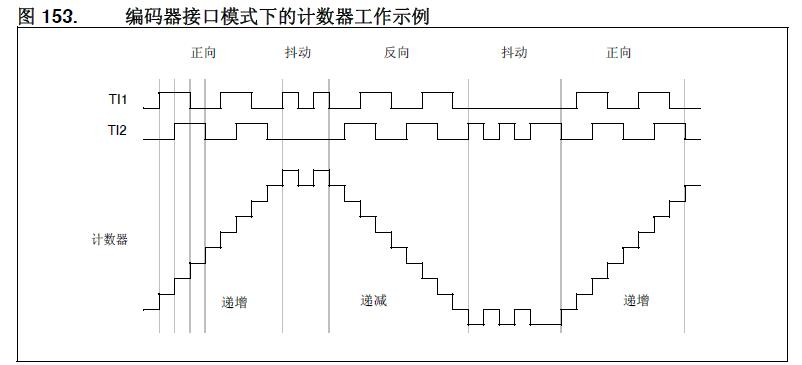

通过查阅芯片手册可以发现，A相和B相有90°的相位差。由图也易知A相信号在前表示正转，计数器自增；B相信号在前表示反转，计数器自减。因此可以HAL库提供的库函数`__HAL_TIM_IS_TIM_COUNTING_DOWN`来捕获计数器是否自减来判断电机的运动方向。


**本文采用的编码器是`TLE5012B-E1000`，MCU为`STM32F407`。其他型号的编码器读取方式大同小异。**

### 磁编码器介绍

以下部分摘录、翻译自 TLE5012B 用户手册

> 磁编码器的**主要组成部分**有：磁编码器芯片、径向充磁强磁。径向充磁强磁与输出轴同轴旋转，磁编码器传感器就位于强磁的垂直上方不远处。
>
> 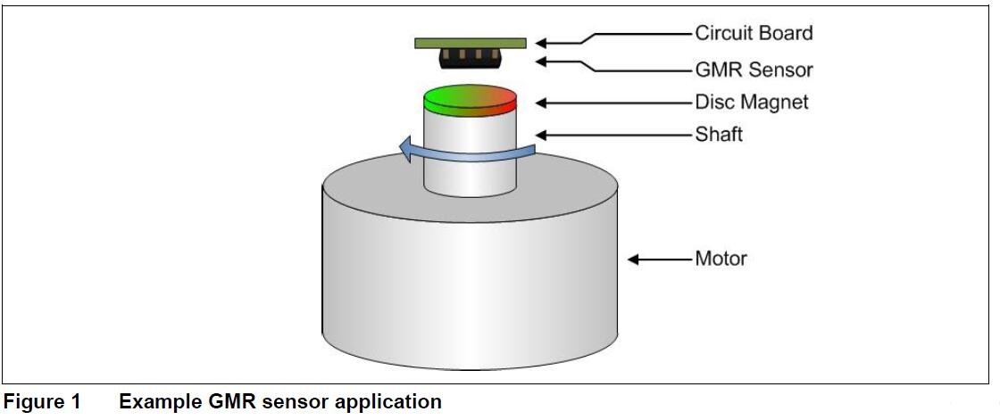
>
> 
>
> 磁编码器芯片内部主要由这几部分组成：GMR巨磁阻/霍尔传感器、ADC模/数转换单元、数字信号处理单元、SSC 接口等。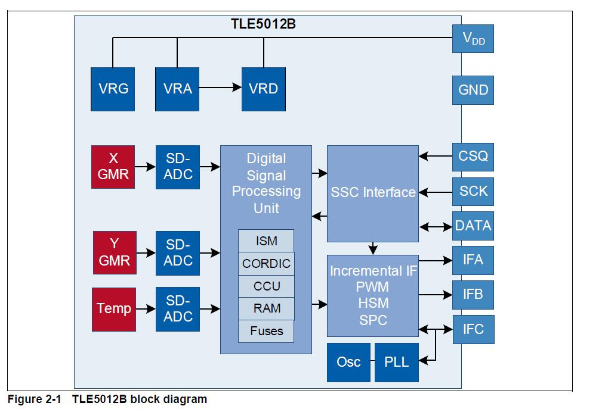
>
> 磁编码器使用垂直整合集成在一起，这意味着，对GMR敏感的区域被集中在器件的逻辑部分上方，它们的电阻取决于磁场的方向的变化。
>
> 四个单独的GMR元件连接成一个惠斯通电桥。 这些GMR元件可感测所施加磁场的两个分量之一：
>
> - X分量，Vx（余弦）
> - Y分量，Vy（正弦）
>
> 采用这种全桥结构，可获得最大的GMR信号，并且抵消彼此的温度效应。
>
> 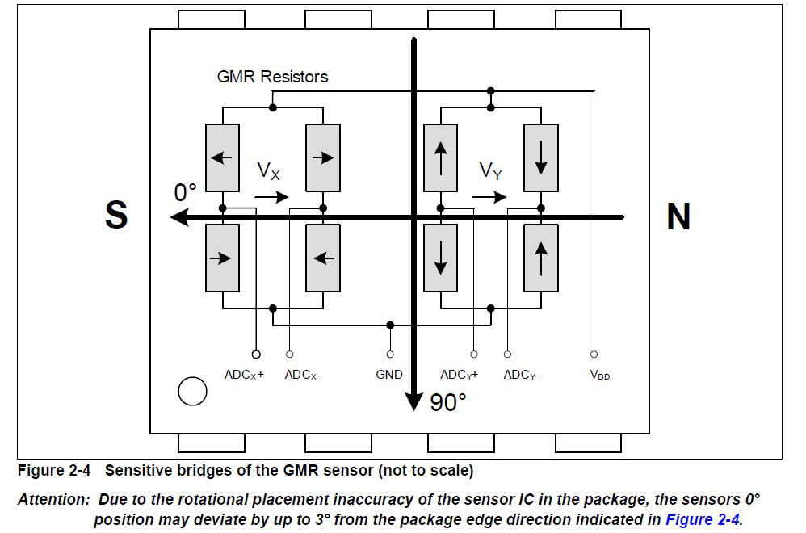
>
> 径向充磁磁铁在元件上方旋转，两组电桥便会产生相位相差90°的正弦波输出。之后ADC采样两个惠斯通电桥的输出，进行数字量化。
>
> 最后使用三角函数ARCTAN2，进行方位角运算，便可从传感器电桥的原始X和Y信号中，计算出真实的360°旋转角度值。
>
> 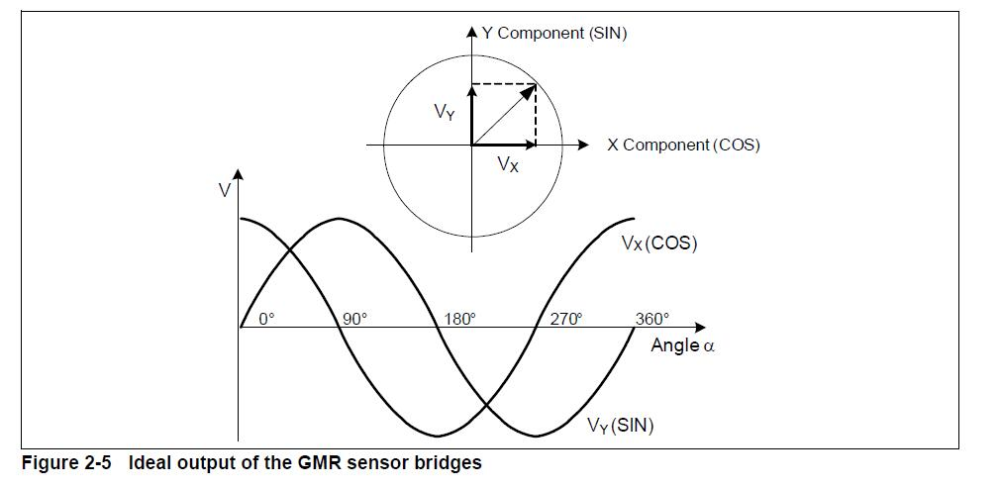

当 `TLE5012B-E1000` 的输出方式为ABI时，其默认分辨率为12位，即`4096`线/圈。

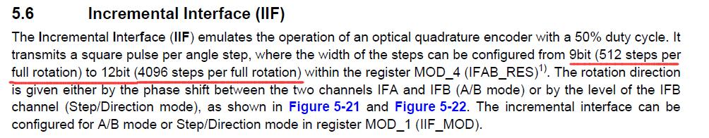

知道了编码器的各项信息，接下来就可以进行相关配置了。

### STM32CubeMX配置

略过选择芯片、配置时钟频率、配置外设的过程，具体教程可以上网参考。

**需要注意的是在STM32F4中，只有高级控制定时器（TIM1, TIM8）和通用定时器（TIM2 到 TIM5）具有编码器接口模式。**下面以 TIM2 作演示。

1. **打开 TIM2 的 Encoder 模式**

   

   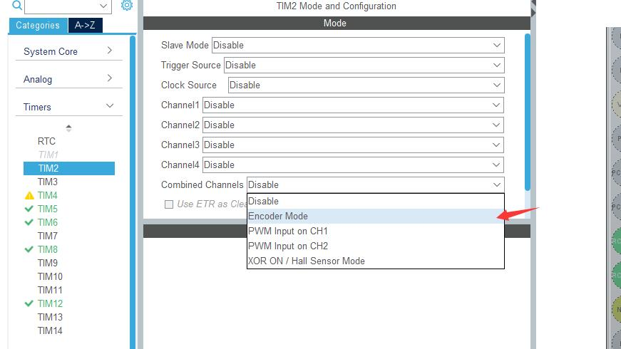

   可以看到 TIM2 的 Channel 1 和 Channel 2 都变成了灰色无法选中，说明只有两个通道是支持编码器接口模式的。

   2. **配置定时器的具体参数**

      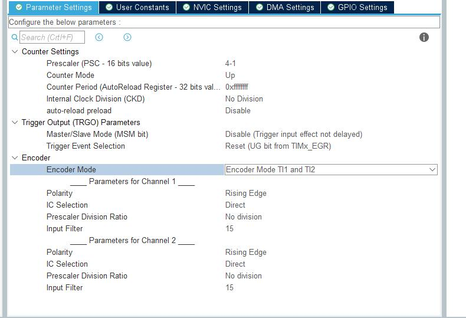

      

我们已经知道，编码器每圈会输出4096个脉冲（PPR (Pulse Per rotation)）。由下图可知，如果仅在TI1处计数，定时器对于上升沿和下降沿都会计数，所以定时器每圈的计数值（CPR (Counts Per rotation)）是 2 倍的 PPR。如果在 TI1, TI2 处均计数，CPR 则是 4 倍的 PPR。**因此可以通过配置定时器分频使得 CPR = PPR。**（非必须）


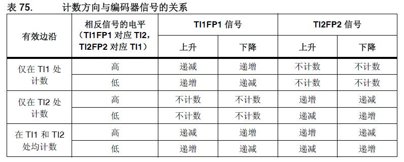


​        在此模式下，定时器就等同于具有方向选择的外部时钟，即计数器会从 0 到 ARR 之间连续计数（或从 ARR 递减到 0）。因此必须配置ARR的值，我们一般默认配置为`0xFFFFFFFF` (32 Bits)或 `0xFFFF`(16 Bits)。Input Filter滤波值是从1-15，看情况设定，是用来滤除一些杂波的。


### 代码编写

1. 使能定时器编码器模式

   在 `tim.c `定时器 2 的初始化函数中，添加下面一行代码

   ```
     /* USER CODE BEGIN TIM2_Init 2 */
   	HAL_TIM_Encoder_Start(&htim2,TIM_CHANNEL_ALL); /** 使能定时器编码器模式 **/
     /* USER CODE END TIM2_Init 2 */
   ```

2. 获取计数值和运动方向

   在程序中调用以下函数就可以获得当前时间下定时器的计数值（CPR）

   ```
   __HAL_TIM_GET_COUNTER(&htim2);
   ```

   调用以下函数就可以获得当前时间下电机的运动方向

   ```
   __HAL_TIM_IS_TIM_COUNTING_DOWN(&htim2);
   ```

   

### 获取位置信息

我们知道了定时器每圈的计数值（CPR），通过下面公式，很容易得到当前电机真实角度

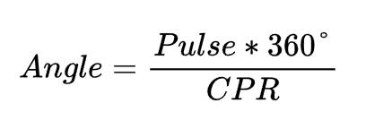

其中，Angle为真实角度，Pulse是当前的脉冲计数值，CPR为单圈总脉冲数。

### 获取速度信息

通过M法可以测量速度信息，公式如下：

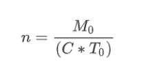

其中，T0是自行设定的时间，M0是在设定时间内的脉冲数，C是单圈总脉冲数（CPR），n为单位时间内转速。

为了实现精准的周期控制，可以使用一个定时器专门用于定时溢出，在溢出回调函数中对编码器的计数值进行捕获操作。

1. 配置计时用定时器

   

   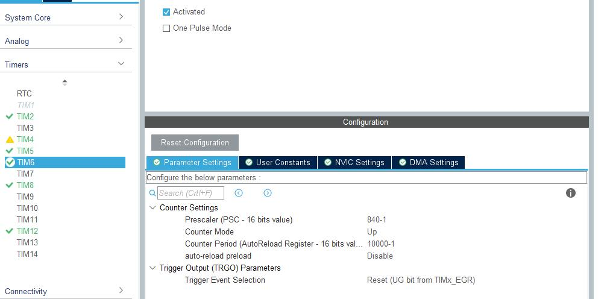

TIM6 挂载在 APB2 总线上，总线频率是 82MHz，通过配置分频和ARR，将溢出周期配置为0.1s。

2. 编写代码

   在 `HAL_TIM_PeriodElapsedCallback` 回调函数中，加入回调函数

   ```
     /* USER CODE BEGIN Callback 1 */
   	else if (htim->Instance == TIM6)
   	{
   		Tim_Elasped_Encoder_Capture();
   	}
     /* USER CODE END Callback 1 */
   ```

   `Tim_Elasped_Encoder_Capture`的函数代码如下：

   ```
   /** 下面代码是读取了三个编码器，根据自己需求删除部分代码即可 **/
   void Tim_Elasped_Encoder_Capture(void)
   {
   	for (int i = 0; i < 3; ++i)
   	{
   		encoder_AS5047P[i].capture_last_count = encoder_AS5047P[i].capture_count;
   	}
   	
   	/** 捕获编码器的当前步数 **/
   	encoder_AS5047P[0].capture_count = __HAL_TIM_GET_COUNTER(&htim2);
   	encoder_AS5047P[1].capture_count = __HAL_TIM_GET_COUNTER(&htim5);
   	encoder_AS5047P[2].capture_count = __HAL_TIM_GET_COUNTER(&htim8);
   
       /** 捕获电机运动方向 **/
       encoder_AS5047P[0].direction = __HAL_TIM_IS_TIM_COUNTING_DOWN(&htim2);
       encoder_AS5047P[1].direction = __HAL_TIM_IS_TIM_COUNTING_DOWN(&htim5);
       encoder_AS5047P[2].direction = __HAL_TIM_IS_TIM_COUNTING_DOWN(&htim8);
       HAL_GPIO_TogglePin(LED_2_PORT,LED_2_PIN);
   
       /** 计算转速 **/
       for (int i = 0; i < 3; ++i)
       {
           encoder_AS5047P[i].error_capture = encoder_AS5047P[i].capture_count - encoder_AS5047P[i].capture_last_count;
       }
       for (int i = 0; i < 3; ++i)
       {
           encoder_AS5047P[i].barrel_velCtrl.rpm = encoder_AS5047P[i].error_capture * 60 / 409.6f; //4096 * 0.1
       }
   }
   ```

通过以上代码，可以读取到电机的实时转速。