在开始使用`CLion`进行日常的开发时，有时候需要对一些变量进行实时监测，但是`CLion`不支持。以前的解决方法要么是通过`STM32Cube MX`文件转换IDE为`MDK-ARM`，在`Keil`上进行调试；要么就是一直打断点，查看变量在每一个循环中的变化。无论是哪个都很麻烦。后来我在ST官网发现了一个工具`STM Studio`，它不仅可以满足我实时查看变量的需求，还可以将数据实时转化为图形格式，能更加直观的看到数据的变化情况。


### 安装STM Studio

> 部分软件在没有科学上网手段的时候下载速度堪忧，所以先在这里提供软件安装包，有需要的可以自取下载。
>
> 网盘分享链接：https://www.aliyundrive.com/s/rB8C6cZ3dWh

先前往官网下载

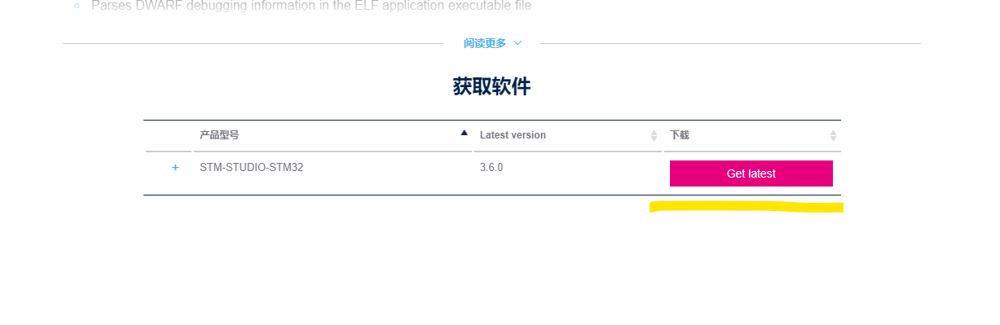

点击`Get latest`按钮后，会需要你同意协议并且输入你的邮箱和姓名。

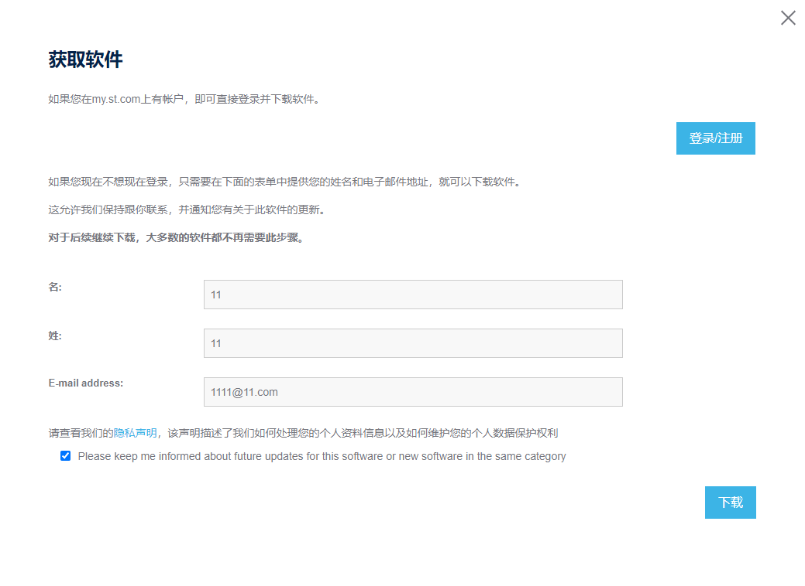

填写完之后在邮箱里会有一个下载链接，点击下载就可以了。


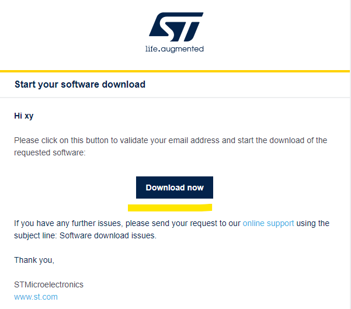


`STM Studio`安装过程很简单，但是需要`Java7`以上支持，如果没有安装相应环境的话安装时会提醒报错的。我试过安装高版本`Java`（Java11），实测还是无法继续安装。但是安装`Java8`就可以了。`Java`的安装很简单，无脑下一步就可以，就是下载有点麻烦，要在<a href="https://www.oracle.com/java/technologies/downloads/">甲骨文官网</a>下载，我分享的安装包里有，这里不赘述了。


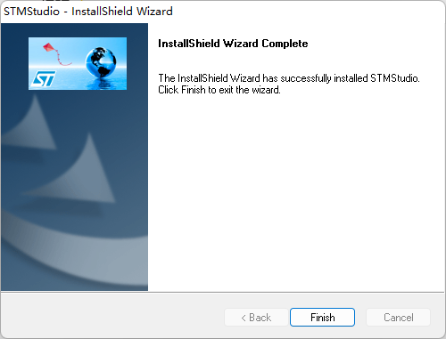


点击`Finish`完成安装。


### STM Studio使用

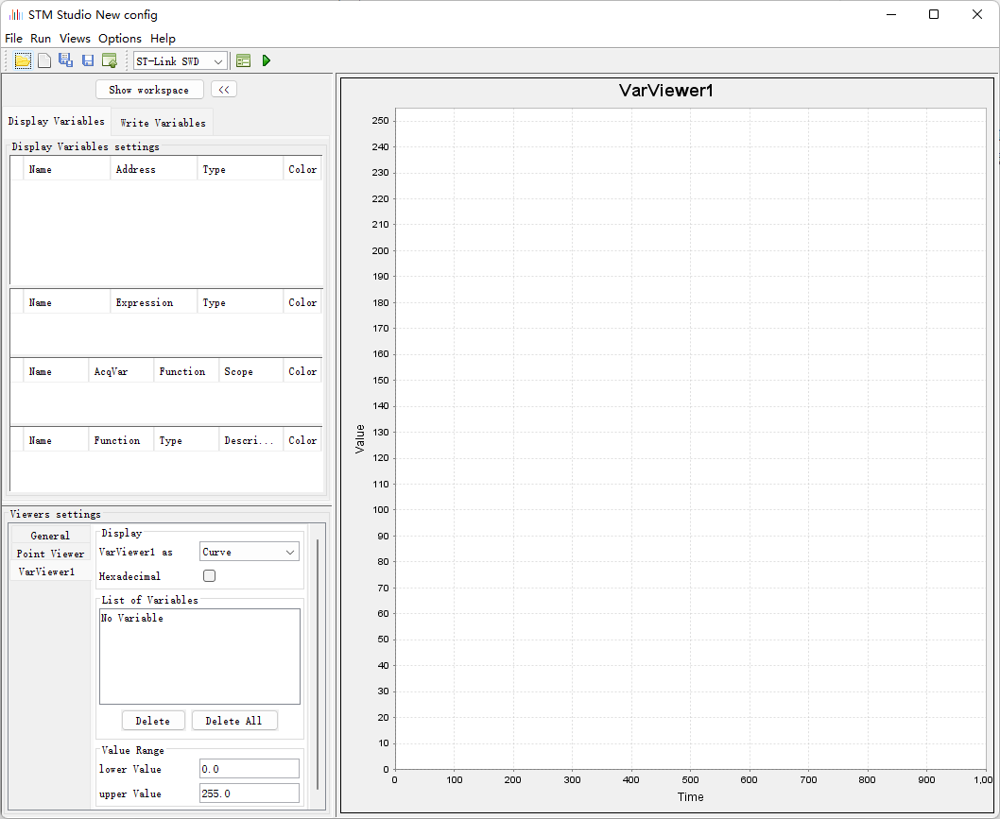

`STM Studio`是通过导入编译生成的可执行文件`（.elf .axf .out）`来实现调试的，对于不同的IDE，生成的可执行文件存放的位置不同，下面只提供`CLion`和`Keil5`的文件路径。

1. CLion

   在项目目录下的`cmake-build-debug`文件夹中。

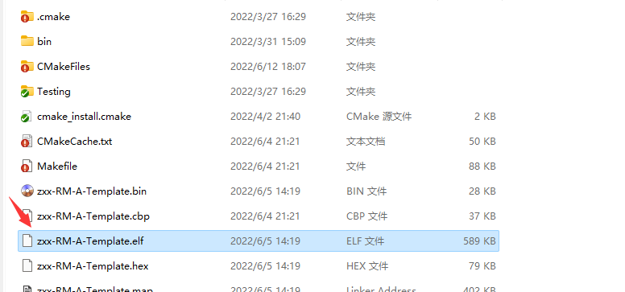


2. Keil5

   在项目目录下的`MDK-ARM/项目名称`中。

   > Keil5应该没有使用这个软件的必要，因为Keil5自带实时变量监测功能。

   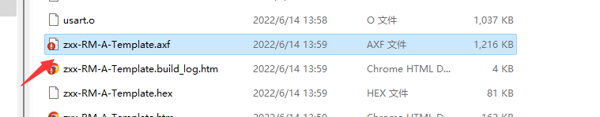

找到对应的文件后，点击`STM Studio`右上角的`File -> Import variables`，在弹出窗口中选定文件。

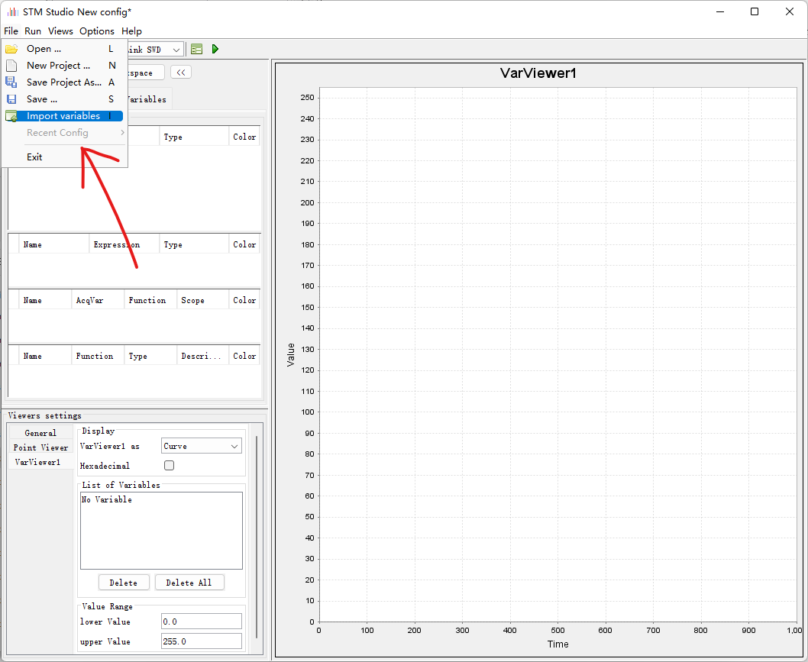


选定文件导入后，如果你的代码中包含了嵌入式操作系统的部分，可能会报错，这些错误不影响我们使用，忽略即可。

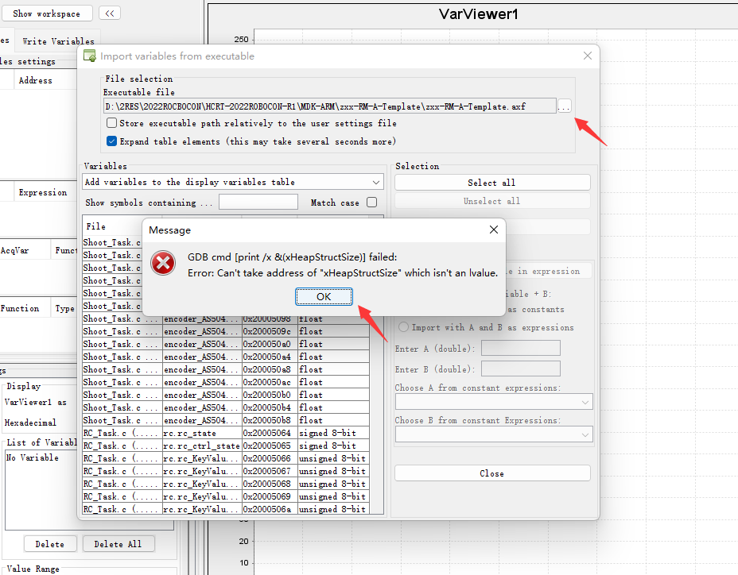

我在程序文件定义了三个变量，用于存储电机的电流、速度和位置：

```
				test_cur = Motor[0].cur;
				test_vel = Motor[0].vel;
				test_pos = Motor[0].pos;
```

在搜索框中搜索可以看见这三个变量：


选定三个变量后，点击右边的`Import`，可以在软件主界面看到这三个变量。

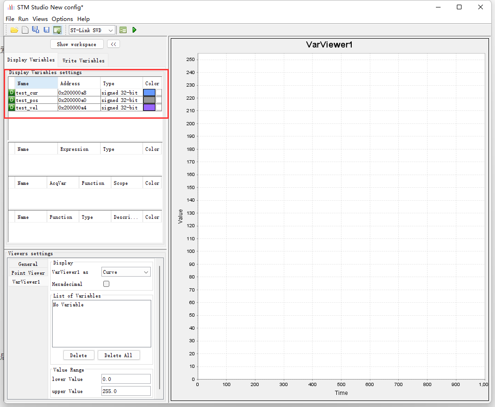

在软件主界面右边，可以看到一个很大的图形区域，上图中右侧的图形区域是`VarViewer1`，我们可以将一个或多个的变量发送到这个区域中。右击左侧变量区域的变量，选择`Send to -> VarViewer1`，在图表下方可以看到对应的图示。

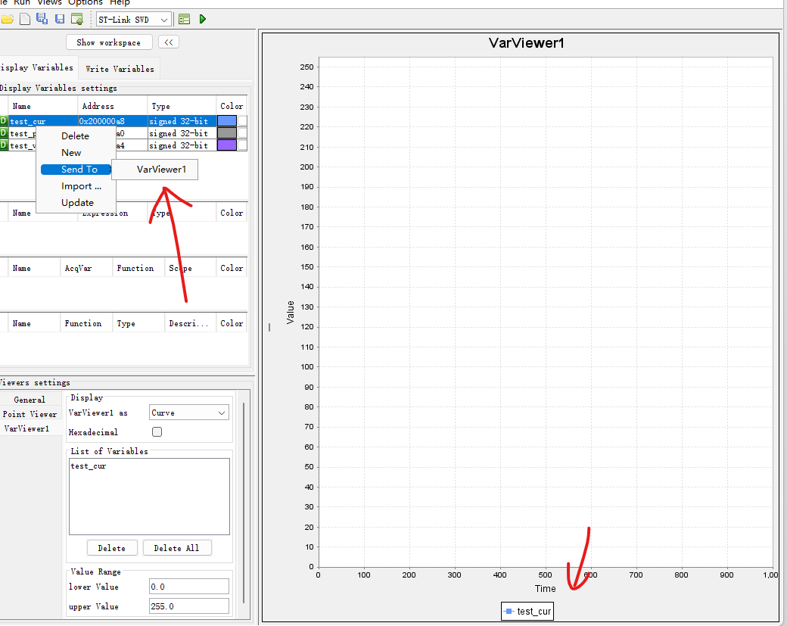

也可以新建多个图形区域。右击软件主界面左下角的`Viewers Settings`区域，选择`New Var Viewer`。

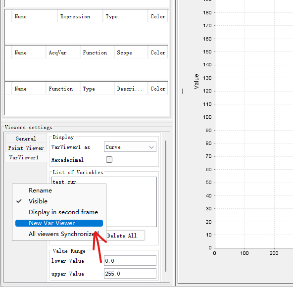

按照上面的步骤，将变量都添加进图形区域中：

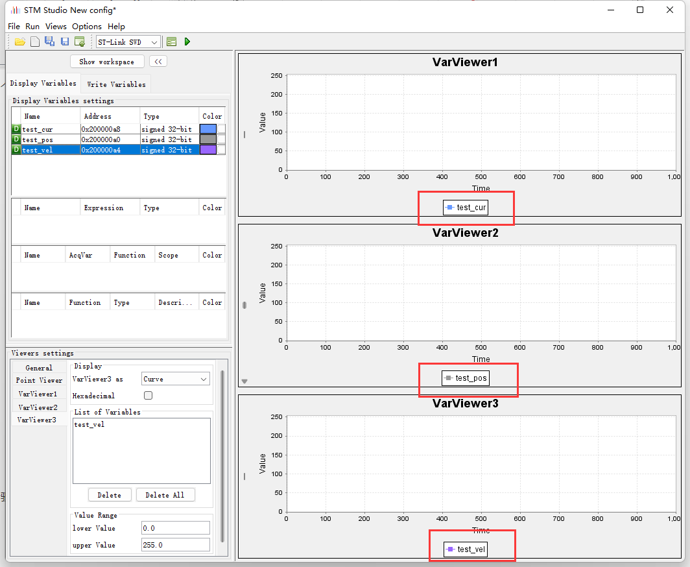

将开发板用ST-LINK与电脑连接起来，在IDE中下载程序后，点击`STM Studio`中上方的开始按钮，即开始进行调试。

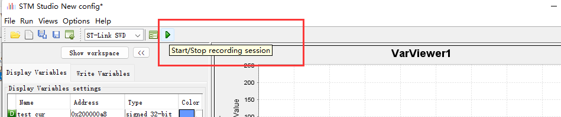

按照自己的需求缩放图表比例，可以呈现比较好的图形效果。

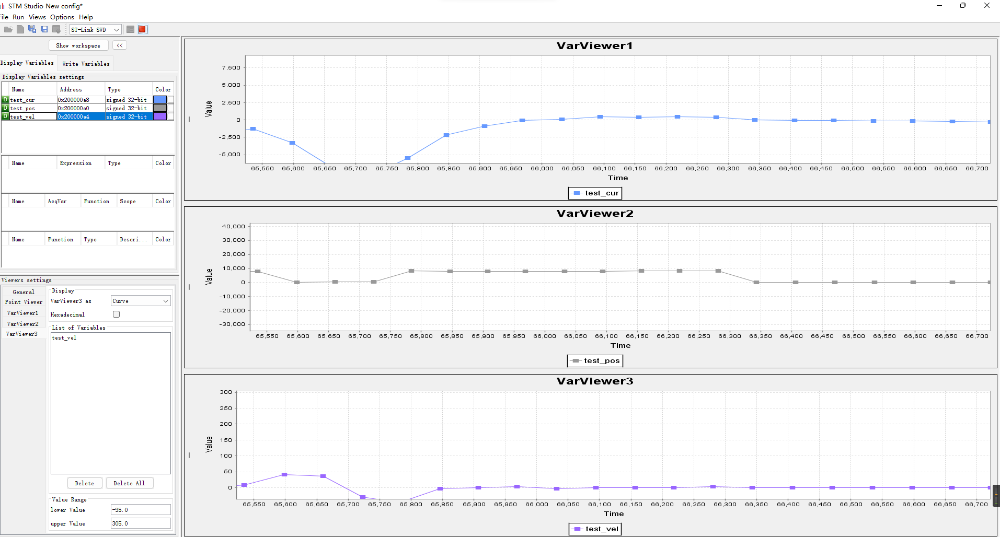


`STM Studio`除了可以显示曲线，还可以通过柱状图、表格的形式实时显示数据，只需要修改左下角的`Viewers Settings`中的选项就可以针对不同的区域切换显示模式。

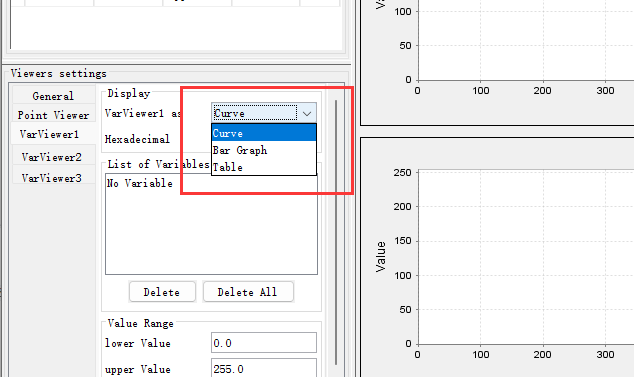

各模式显示效果如下：

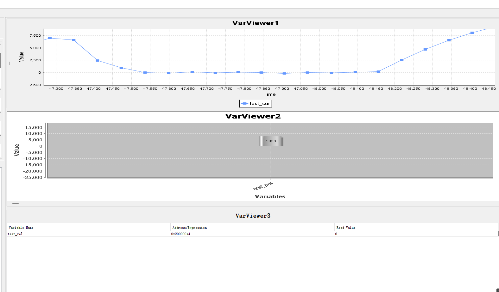

从上到下依次为曲线、柱状图、表格。
