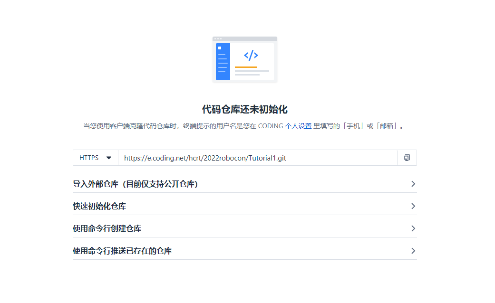
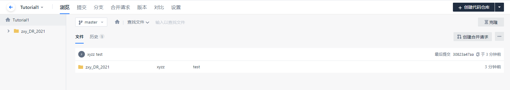

使用Git将代码上传到Github，可以很方便地进行代码的版本管理。但是由于大部分时间在国内访问Github的速度不太理想，而且上传的时候也经常出错。现在有部分团队使用Coding进行团队代码管理，试了一下，效果还是不错的。

### 下载安装Git

安装十分傻瓜式，<a href="https://git-scm.com/" target="_blank" rel="noopener">官网下载</a>安装包直接安装即可,这里不做介绍。


### 注册Coding账号，加入Coding项目
注册账号时最好让已经在项目里的成员邀请加入，这样就不需要在注册时创建自己的团队。


### 在项目中创建新仓库用于存放代码


> 重要代码建议选择私有仓库

创建完毕后显示如下：



不要关闭这个页面，后面我们还需要它，接下来先进行本地仓库的配置。

### 创建本地仓库并上传到Coding
1. 在所需要上传代码的文件夹内鼠标右击空白处，选择`git bash Here`，在弹出的窗口中输入：
```
git init
# 此步操作完成后，会在此文件夹下生成一个隐藏的.git后缀文件，同时生成一个本地仓库用于对比和存放代码片段
```
2. 如果是第一次上传到Coding的项目中，需要输入Coding的账号信息
```
# 将 abc@example.com 修改为你Coding用户的邮箱
git config user.email "abc@example.com"
# 将 abc 修改为你在此项目中的用户名
git config user.name "abc"
```

3. 将文件添加并提交到本地仓库
```
git add .
# add 和 . 间有一个空格
git commit -m "项目描述"
```

4. 将文件推送到Coding服务器
    **这里需要用到上面在Coding上新建仓库时所生成的链接**，它是git后缀，将它复制下来。
```
# 先将本地仓库和远程仓库（即Coding上的目标仓库）进行连接
git remote add origin https://xxxxxxx.git
# 将代码推送到服务器
git push origin master
```


执行完毕后，就可以在Coding上看到对应的提示和文件夹了。




### 将更新后的代码文件上传到Coding
更新代码的过程和上述过程很类似，如果在代码文件夹中我们已经创建了本地仓库，所做的只需要添加文件、提交文件到本地仓库、推送文件到服务器这几个步骤。
**如果你要上传代码的仓库中不止有你一个人维护，则切记在上传前获取一下最新的仓库：**
```
git pull origin master
```
1. 添加、提交文件到本地仓库
```
git add .
git commit -m "更新说明"
```
2. 推送代码
```
# 将代码推送到服务器
git push origin master
```

### 下载Coding上的仓库文件
如果需要获取已经存在于Coding上的仓库，步骤如下：
1. 在对应仓库中点击克隆，复制git链接


2. 在电脑中新建一个文件夹用于存放该仓库文件

3. 克隆文件
在文件夹中调出Git窗口，输入：
```
# 如上图所示git链接
git clone https://e.coding.net/hcrt/2022robocon/Tutorial1.git
```


  查看本地文件夹，可以看到已经将代码下载到本地。

  

### 配置SSH代理
当你对github使用git操作时很慢，甚至报timeout错误，你需要配置一下SSH的代理走科学通道。
- Windows
```shell title="~/.ssh/config"
# Windows 全局
ProxyCommand "C:\Program Files\Git\mingw64\bin\connect.exe" -H 127.0.0.1:7890 %h %p

# 针对某个网站 eg. github
Host github.com
  ProxyCommand "C:\Program Files\Git\mingw64\bin\connect.exe" -H 127.0.0.1:7890 %h %p
```
这里 git 的安装路径和后面的代理端口根据自己修改。我使用的是Clash，默认7890端口，走HTTP协议。-S 是 socks 代理，默认是 socks5，如果要使用 HTTP 代理，就写 -H。

- Linux / MacOS
```shell title="~/.ssh/config"
# Linux / MacOS 全局
ProxyCommand nc -X connect -x 127.0.0.1:7890 %h %p

# 针对某个网站 eg. github
Host github.com
    User git
    ProxyCommand nc -X connect -x 127.0.0.1:7890 %h %p
```

<br/>
<p align="right"><i> <font size="3"><font color = "brown">Last update on</font>: 2024/01/27 </font></i></p>
