不知道是不是全国的大学都一样，在宿舍内用4G网络真的是卡的不得了。这我哪能接受啊？开学没过几天就京东下单了一个TP-Link的路由器，还好学校没啥限制，提供的网线可以直接插WAN口上用。但是没过几天，wifi就开始炸了，而且只要连接的人一多，那根本别想用。起初以为是路由器质量问题，换了一次货（在这里表扬京东，退换货太舒服了），没过几天又出现一样的情况，我实在是对它没辙了:(
正当我准备认命的时候，突然了解到了软路由这个玩意儿。我们平时用的路由器都算是硬路由，里面的硬件和软件都由提供；而软路由本质上就是一台电脑，硬件软件都可以你自己设计，有很强的扩展性和可玩性。而我手上刚好有一个实验室提供的树莓派4B，折腾了好几周，这期间还自己掏腰包买了个树莓派3B，觉着这是一件值得记录的事情，打算写点东西供自己或者他人可以参考。


------------

## 传送门
- <a href="#1">准备OpenWrt固件</a>
- <a href="#2">将固件刷入SD卡</a>
- <a href="#3">网络配置</a>
- <a href="#4">补充说明</a>

------------
<div id="1"></div>

### 准备OpenWrt固件
1. 自己编译（有点麻烦，不想折腾的可以看第二部分）

在开始编译之前，我们需要准备一个Ubuntu环境，版本建议选择18 LTS。配置环境可以使用VirtualBox虚拟机，也可以用云服务器（推荐）。这里多说两句，为啥不用VMware？因为这个软件装上Ubuntu会莫名其妙黑屏，网上的解决方法我都试过了也不行，而且VirtualBox是开源的，免费。然后云服务器我用的是阿里云的学生机，做10道题可以免费用两个月。因为编译过程会自动下载Packegs并且产生很多文件，配置的Ubuntu系统建议留下至少30GB空间。关于怎么安装Ubuntu我在这里就不在赘述了，网上教程已经很多了。


在安装好Ubuntu后，我们需要下载OpenWrt源码。在这里推荐<a href="https://github.com/coolsnowwolf/lede" target="_blank" rel="noopener">Lean的源码</a>，更新迅速并且很稳定。在源码仓库的Readme.md中已经有详细的使用教程，我们只需要一步一步走下去就行。**(接下来的全部编译步骤建议在全局科学上网下进行，不然容易出现TIMEOUT)**

在开始编译之前，需要创建一个非root用户。在Ubuntu的桌面环境下创建新用户非常简单，根据图示操作即可。

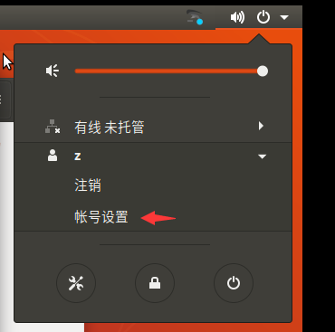

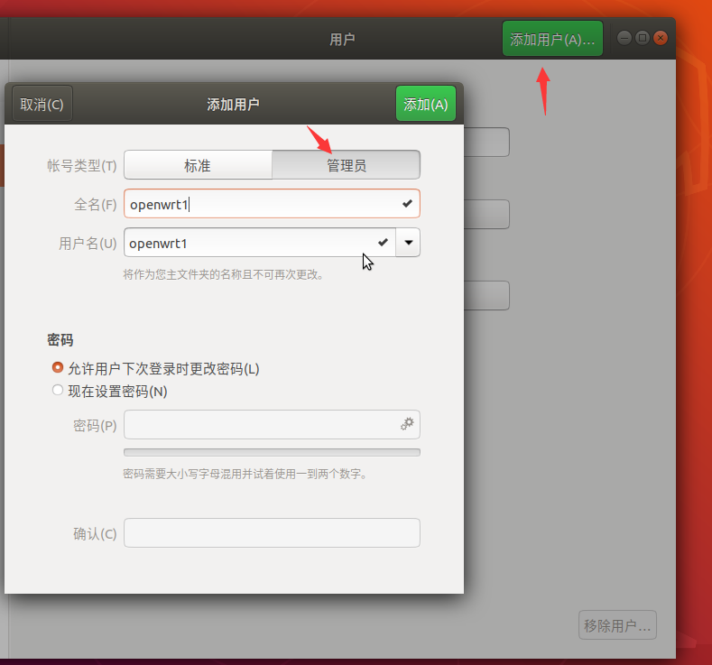

创建好用户后，点击上二图注销按钮，切换到你创建的用户，再进行下面的操作。

`sudo apt-get update`


接下来安装编译过程中需要的各种依赖包
`sudo apt-get -y install build-essential asciidoc binutils bzip2 gawk gettext git libncurses5-dev libz-dev patch python3 python2.7 unzip zlib1g-dev lib32gcc1 libc6-dev-i386 subversion flex uglifyjs git-core gcc-multilib p7zip p7zip-full msmtp libssl-dev texinfo libglib2.0-dev xmlto qemu-utils upx libelf-dev autoconf automake libtool autopoint device-tree-compiler g++-multilib antlr3 gperf wget curl swig rsync`

安装完建议再执行一次命令，显示如下图所示则安装成功。


然后使用`git clone https://github.com/coolsnowwolf/lede`命令下载好源代码，然后`cd lede` 进入目录。

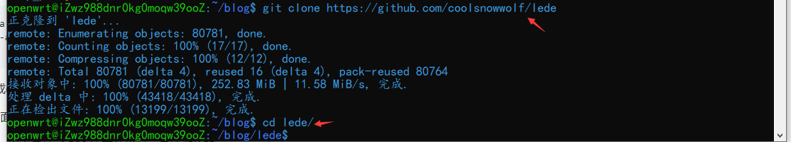

在lede文件夹下，执行`./scripts/feeds update -a && ./scripts/feeds install -a`

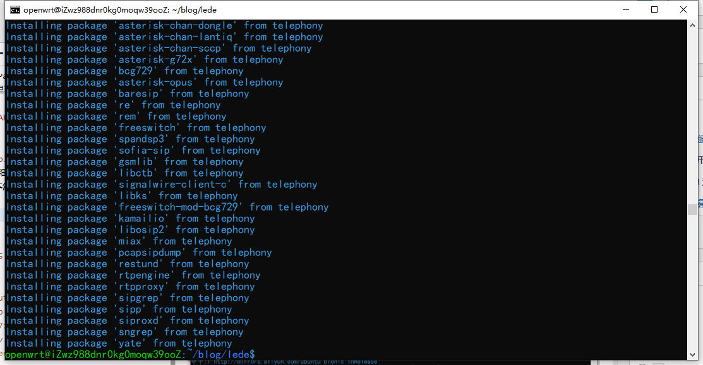

上述操作执行完毕后，输入`make menuconfig`即可进入配置界面。

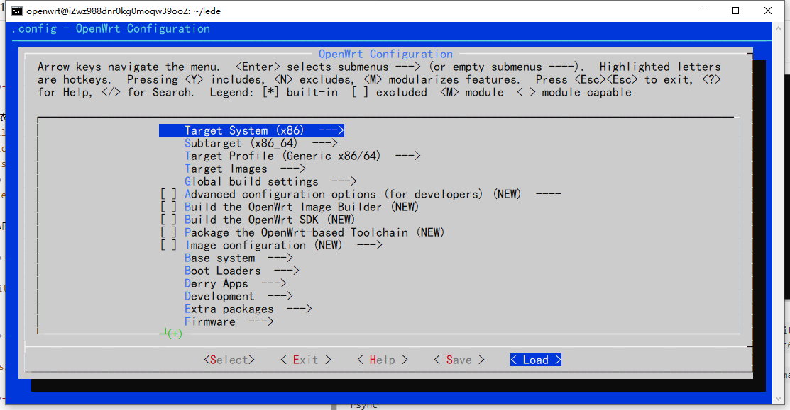

在配置界面中，上下方向键可以移动光标，左右方向键可以移动底部栏光标。回车进入所选内容，两次ESC返回上一级。

这次我们选择用树莓派3B来做软路由，所以前三项我们选择如下：

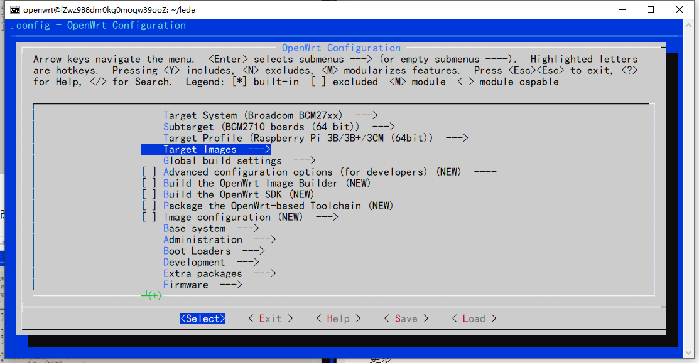

如果是树莓派4B，则将第二项的芯片修改为BCM2711即可。

然后进入Target Images，在这里修改固件分区大小。太小了会导致在编译过程中出现错误，修改为下图大小即可。


回到主菜单，进入Kernel modules -> USB Support，在这里我们添加**USB设备驱动支持**（大容量存储（即U盘）、USB网卡等等）。建议全部选择（注意要变成星号才是要编译进固件，按S可以快捷选中），**但是不要勾选kmod-usb-serial这一项，这个驱动的源码好像有问题，勾选了之后编译会不通过。**


现在我们对OpenWrt固件的基本配置已经完成，接下来就可以去选择要安装的各种插件。但是在这之前，建议大家先进行一次**单线程编译**，看看有没有报错。没有报错编译完成后再重新进入配置界面选择需要的插件，然后再开启**多线程编译**，速度会快很多。

左右移动底部栏光标到 **Save** 处，回车进入保存页面，直接保存为.config即可。（我自己折腾的时候还改了名字，编译过程中就一直找不到这个配置文件，因为编译默认读取的是.config这个名字）保存后移动到Exit回车退出。

回到终端，执行命令`make -j8 download V=s`来下载dll库(国内请尽量全局科学上网)。

然后执行`make -j1 V=s`进行单线程编译。


这个过程要执行两三个小时，编译完成后，在`/lede/bin/targets`路径下会有编译好的四个固件。关于这四个固件的区别可以参考<a href="https://mlapp.cn/1004.html" target="_blank" rel="noopener">这篇文章</a>。


接下来我们再通过终端进入lede的根目录`cd lede`然后`make menuconfig`，配置插件。我们可以看到已经内置了许多的插件供我们选择：

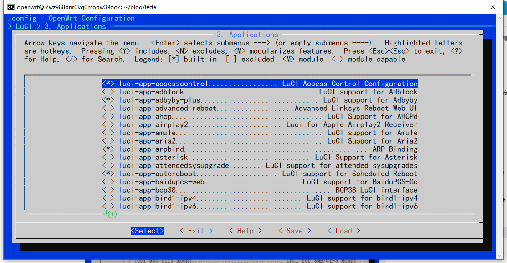

如果列表里没有想要选择的插件，可以将插件下载到`lede/package`中再打开配置界面选择。接下来推荐几个比较实用的一些插件：
```cpp
#科学上网插件
git clone --depth=1 -b master https://github.com/vernesong/OpenClash
git clone --depth=1 https://github.com/xiaorouji/openwrt-passwall
//我自己用的是passwall

#校园网认证插件
git clone --depth=1 https://github.com/BoringCat/luci-app-mentohust
git clone --depth=1 https://github.com/KyleRicardo/MentoHUST-OpenWrt-ipk

#广告过滤插件
git clone https://github.com/rufengsuixing/luci-app-adguardhome

#应用过滤
git clone https://github.com/destan19/OpenAppFilter

```
下面推荐常用的几个插件：
- luci-app-adguardhome 功能强大的全网络广告和跟踪程序拦截DNS服务器
- luci-app-access-control 上网时间控制
- luci-app-docker 容器
- luci-app-frpc 内网穿透客户端
- luci-app-nps 内网穿透插件
- luci-app-kodexplorer 可道云
- luci-app-ddns 动态域名解析
- luci-app-netdata 网络监控插件
- luci-app-samba 网络共享文件夹（小NAS）
- luci-app-unblockmusic 解锁网易云灰色歌曲
- luci-app-ttyd 网页终端插件
- luci-app-wol 网络唤醒
- luci-app-jd-dailybonus 京东签到服务

选择好插件之后，我们在**LuCI -> Themes**看一下OpenWrt管理界面的主题，自带4个，建议全选慢慢挑。


配置界面的东西实在是太多了，其他的选项大家可以自己慢慢研究，根据自己的需求编译一个属于自己的OpenWrt固件。

接下来退出配置界面，这次我们使用多线程编译`make -j$(($(nproc) + 1)) V=s`，速度会快很多，但是如果你的网络不是很好。在下载插件包的过程中可能会报错，所以还是强烈建议大家在**科学上网环境**下进行编译。

这次编译完毕后，固件还是在`/lede/bin/targets`路径下，至于怎么把该路径下的文件移到我们电脑的文件夹中，**云服务器建议使用FileZilla，虚拟机建议使用共享文件夹**。具体做法这里不赘述。

至此，OpenWrt的编译过程结束。

2. 使用别人编译好的固件

自己编译固件的过程确实很乏味，操作难度也挺高，对Linux和科学上网不太了解的人进行实操可能会消耗很多时间，所以大家可以下载别人编译好的固件，直接刷入即可。这里推荐SuLingGG编译好的固件。
先说大神编译的固件：打开<a href="https://github.com/SuLingGG/OpenWrt-Rpi" target="_blank" rel="noopener">SuLingGG的OpenWrt-Rpi仓库</a>，找到设备支持情况这一栏，点击你要安装OpenWrt固件的设备那一栏的**下载页**选项。


这些都是编译好的固件供大家下载，这些固件的区别可以看<a href="https://mlapp.cn/1004.html" target="_blank" rel="noopener">这篇文章</a>的**文件格式区别**一栏。一般选择ext4-factory那一个。点击文件名即可下载。


<div id="2"></div>

### 将固件刷入SD卡
这部分内容和树莓派刷入其他系统的操作是完全一致的。
将下载好的固件解压，得到IMG格式的文件。然后将SD卡进行格式化，格式化工具用 **DiskGenius** 或者 **SD Card Formatter** 都可以（也许系统自带的格式化也能用但是我没试过）。格式化后使用 **Win32DiskImager** 刷入固件。将烧录好的SD卡插到树莓派上，通电开机。

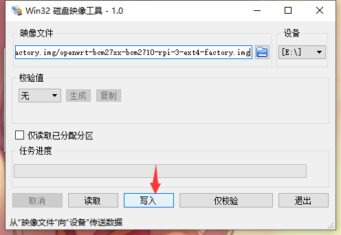

<div id="3"></div>

### 网络配置
在树莓派绿灯频繁闪烁完毕后，用网线将树莓派和电脑连接起来，如果提示有网络接入即系统启动成功。在这之前最好断开其他所有的网络连接防止后台IP冲突。


在浏览器中输入`192.168.1.1`进入路由器后台，默认用户名是`root`，密码是`password`。

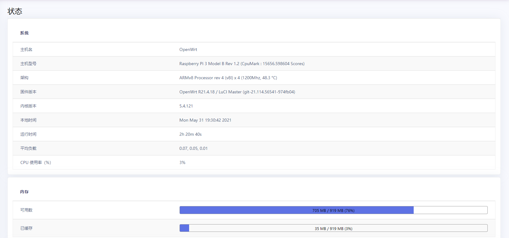
<center>路由器概况</center>

接下来点击网络 -> 接口 -> 添加新接口。**图片会和新安装的有出入是因为我这个是配置好的，大家只要按照图中标识进行操作即可。**


新接口名称我们写 **wan** ，接口协议选择 **DHCP客户端**


点击提交后，选择**防火墙设置**，配置为 **wan 区域**，点击**保存（注意不是保存&应用！）**


然后我们设置无线网络。点击网络 -> 无线 -> 修改。


**注意设备配置界面，如果你不熟悉不建议更改。**

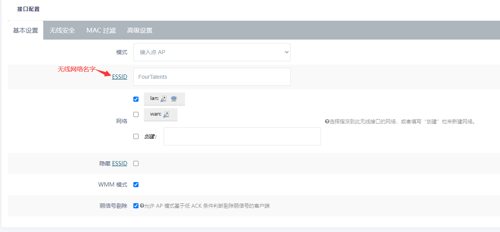

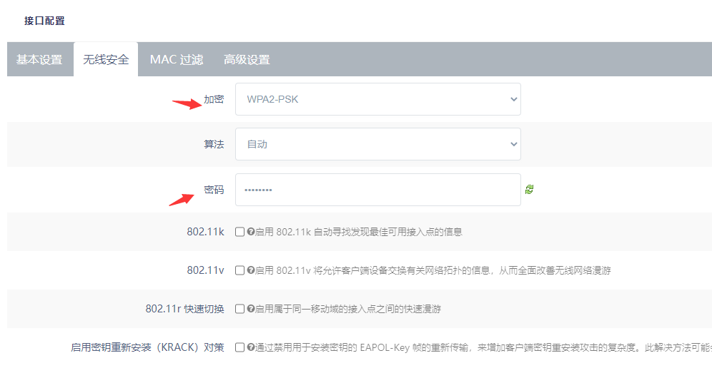

最后点击右下角的保存&应用，把之前你接在路由器WAN口上的线接到树莓派上，按照你刚刚设置的wifi名字和密码连接wifi就可以上网冲浪了。

关于OpenWrt的配置就说明到这里，其他的东西在上述配置完毕后可以自行探索，你会发现OpenWrt给你打开了新世界的大门。

<div id="4"></div>

### 补充说明
1. 旁路由的设置？

参考<a href="https://iroot.cc/86.html" targer="_blank">这篇文章</a>即可。

2. 树莓派只有一个以太网接口，想使用网线直连上网怎么办？

使用USB - 以太网转换器。可以参考<a href="https://mlapp.cn/1009.html" target="_blank" rel="noopener">这篇文章</a>。然后进入OpenWrt管理界面，点击网络 -> 接口 -> 修改LAN接口 -> 物理设置。新接入的网卡应该是eth1，不确定的可以在接入转换器后到状态 -> 内核日志最下方查看。

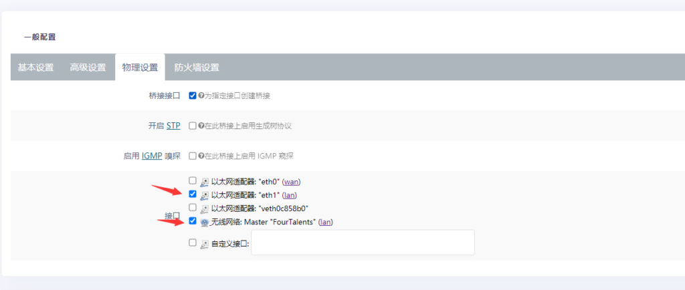

这里物理配置的意思就是把LAN接口应用到对应的接口上。比如说我勾选了无线网络使用LAN接口，无线网络的数据就通过LAN口收发；同理如果是勾选了eth1接口，那么我的USB网卡转换器就相当于接到了LAN口上，通过LAN口收发数据。

3. 要定时关机吗？

不需要。树莓派本质上就是电脑，电脑本身就是消耗品，使用频率高低不会影响他的使用寿命，该坏还是得坏，该炸还是得炸。

------------

**Reference:**
1. <a href="https://www.bilibili.com/read/cv9714518" target="_blank" rel="noopener">树莓派4B 亲手打造一款Openwrt软路由(带编译固件-超详细) - RaspberryPi硬核系列(三)</a>
2. <a href="https://mlapp.cn/categories/openwrt/" target="_blank" rel="noopener">美丽应用OpenWrt分类</a>
3. <a href="https://github.com/coolsnowwolf/lede" target="_blank" rel="noopener">Lean's OpenWrt source</a>
4. <a href="https://github.com/SuLingGG/OpenWrt-Rpi" target="_blank" rel="noopener">Raspberry Pi & NanoPi R2S/R4S & G-Dock & x86 OpenWrt Compile Project.</a>